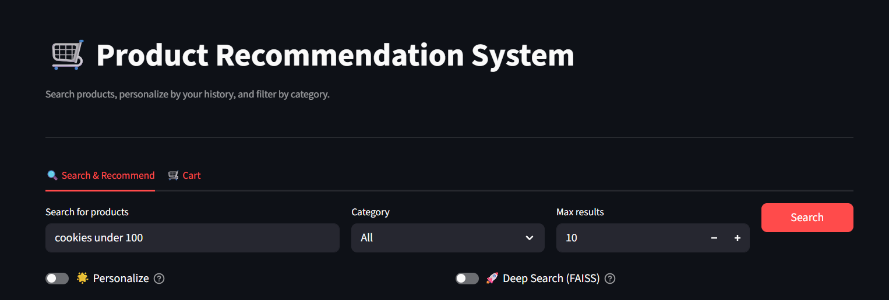
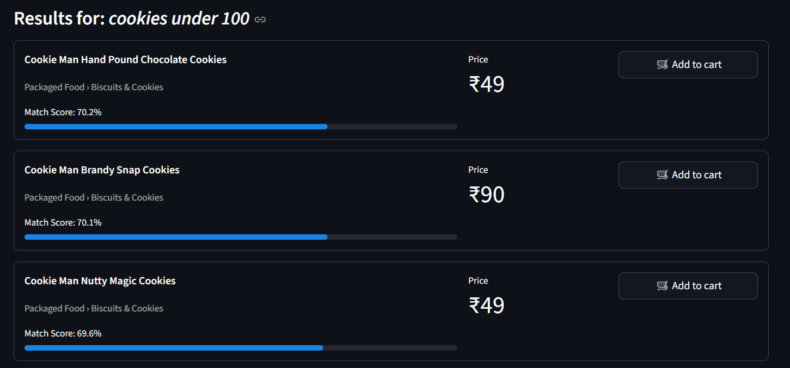
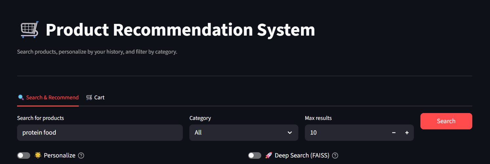
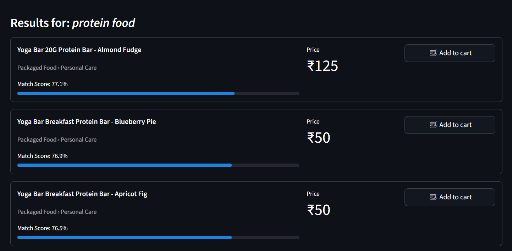

# Product Recommendation System

An AI-powered product recommendation system using semantic search, personalization, and natural language price filtering.

# Project Overview4

An intelligent e-commerce recommendation system that combines:

-Semantic Search: Natural language product queries
-Personalization: Learn from purchase history
-Price Filtering: Natural language (e.g., "chips under 200")
-Dual Search: Fast FAISS or exact NumPy search

# Model Selection 

BGE (BAAI/bge-base-en-v1.5)

-#1 on MTEB benchmark for semantic search
-768-dim embeddings with 109M parameters
-Optimized for query-to-document retrieval
-Instruction-aware with query: prefix support
-Production-ready with FAISS integration

# Libraries Used

streamlit - 1.32.0  ==  Web UI framework
pandas - 2.2.1 == Data handling
numpy - 1.26.4 == Vector operations
sentence-transformers - 2.5.1 == BGE model
faiss-cpu - 1.8.0 == Fast similarity search

# Installation & Setup

1. Clone or Download the Project

git clone <repo-url>
cd product-recommender

2. Install Dependencies

pip install -r requirements.txt

3. Clean the Dataset

python clean_data.py

4. Generate Embeddings

python generate_embeddings.py

5. Run the Streamlit Recommendation App

streamlit run frontend.py

# screenshots of result 

input1: 

output1: 

input2:

output2: